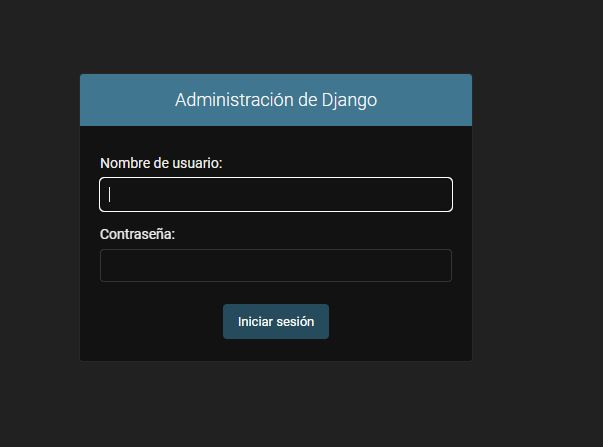

# Requerimientos para realizar deployd del Microservicio
####El editor de codigo que se uso fue pycharm

####Paquetes usados :
    pip install Django==4.1.1
    pip install mysqlclient pymysql 

###Base de datos
        create database api_django1;
        *Se creo y configuro en base a los siguientes parametros:

#### Integrar BD
        python manage.py migrate 
        *Todas las accions deben tener un 'OK', ratificando la 
        conexion exitosa y la creacion de tablas

####Se ejecuta el comando python manage.py runserver 1234
####estando en la ruta "Django_SQL_API\Proyecto_Api"    

###Se inicializa en la url: http://localhost:1234/admin y nos arroja la siguiente imagen

####las credenciales son user: leo, password: leo

###Vista1
        una vez dentro de la interfaz:

        podemos verificar y hacer el ingreso de algun empleado o departamento

###Campos del empleado
        aqui podemos visualizar los campos requeridos o a diligenciar, 
        le damos click en guardar y la operacion debe ser exitosa:

##CRUD
###GET
        Se procede a realizar por medio de POSTMAN a la url:
        http://localhost:1234/api/empleados/ por el metodo GET y 
        nos genera:

###POST
        Se procede a realizar por medio de POSTMAN a la url:
        http://localhost:1234/api/empleados/ por el metodo POST
        y nos genera:

####Verificando:

###PUT
        Se procede a realizar por medio de POSTMAN a la url:
        http://localhost:1234/api/empleados/8 por el metodo PUT 
        usando el siguiente json:
        {
      "codigo": 124534444,
      "nif": 275551111,
      "nombre": "mario",
      "apellido1": "castañeda",
      "apellido2": "goku123",
      "codigoDepartamento_id": 2
        }
        para editar el registro que acabamos de ingresar:

####Verificando
        Lo podemos validar en la URL http://localhost:1234/api/empleados/ o en el POSTMAN
        con un GET

###DELETE
        Se procede a eliminar el registro que acabamos de ingresar:
  
####Verificando
        Lo podemos validar en la URL http://localhost:1234/api/empleados/ o en el POSTMAN
        con un GET

####Comentarios:
        *Lo realize en Mysql ya que Postgres no lo he manejado como deberia
        * El proyecto se inicializo en Docker pero por temas de tiempo no alcanze a empaquetarlo
                ya que hasta hace poco empeze a capacitarme sobre kubernetes
        * La relacion de las tablas se puede validar el erchivo models.py
        * Espero que sea de su agrado y de antemano muchas gracias por la oportunidad

    